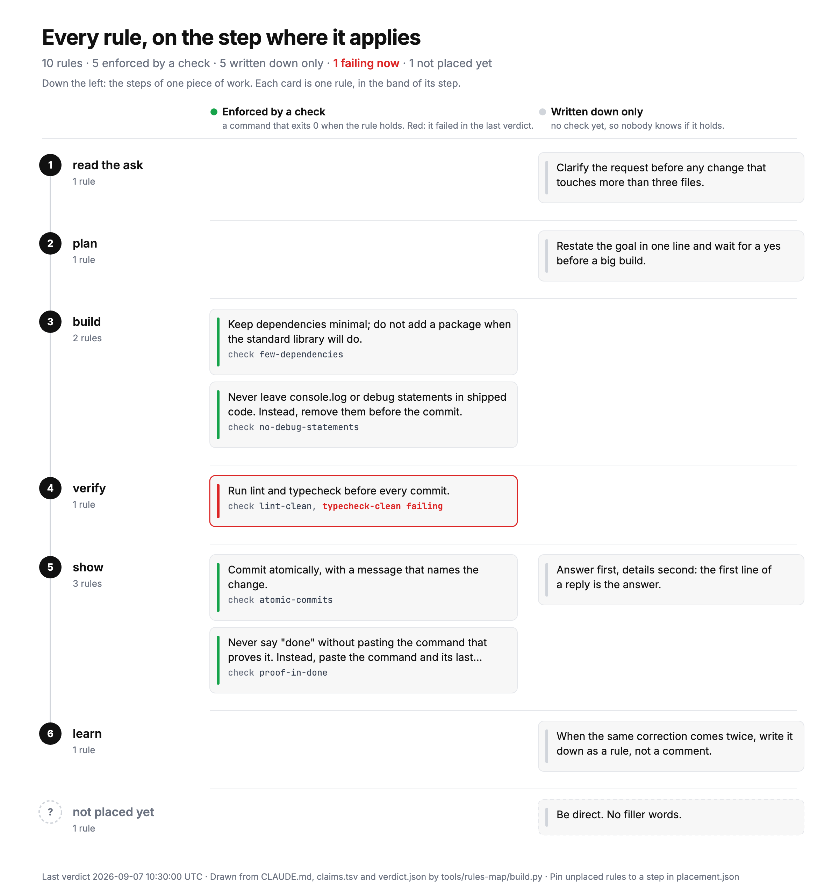

# metacognition

Your AI reads your rules and ignores them. This measures which ones, every 30 minutes, and
draws it.

Metacognition means thinking about your own thinking. That is what this does for a coding
agent: it watches whether the agent still follows the rules you wrote for it.

**Works with Claude Code, Codex, Cursor, Gemini CLI and anything else that reads an instructions
file.** Rules are plain shell commands, so nothing here is tied to one tool. The shipped rules find
whichever file your agent reads: `CLAUDE.md`, `AGENTS.md`, `.cursorrules` or `GEMINI.md`. Tested
against a home with each one, and against a home with none.

Built by a 21-year-old solo founder in Bangkok who got tired of repeating himself to his AI.

**The number.** In August 2026, 82 of 991 messages to Claude Code were corrections: 8.3%.
In June it was 22 of 494: 4.5%. Counted by matching phrases like "again", "redo" and
"not what I" in the messages. No AI judged it. Adding rules to CLAUDE.md did not bring it
down. It went up. So the rules became checks, and the checks run on a timer.



**One line to install** (macOS or Linux, Node 18 or newer, asks nothing):

```sh
npx metacognition
```

**What it does**

1. Turns a rule into a check: one row in `claims.tsv`, with a command that exits 0 when the
   rule holds.
2. Runs every check every 30 minutes, and prints the verdict at the start of each session.
3. Logs every correction you type, names the ones you typed 3 times, and draws the map.

**How you will know it works:** the first red light on a rule you thought was followed.

## What you get

Six things you cannot get today.

**1. You find out which rules your agent quietly stopped following.** Every rule becomes a command
that must pass. It runs every 30 minutes. A broken rule appears in the first line of your next
session. Run against a real, heavily used setup, the 11 example rules found 2 already broken that
the owner did not know about.

**2. A number instead of a feeling.** "The agent ignores my rules" becomes a pass rate per rule:

```text
  memory-index                 0/4   green   0%  RED now
  claude-md-short              1/4   green  25%
  hooks-exist                  4/4   green 100%
```

A rule at 25% is one your agent keeps breaking. Now you know which rule to rewrite.

**3. Your rules file can get shorter.** Every time the agent gets something wrong, you add a line.
The file grows, a long file gets skimmed, and the new rules weaken the old ones. When a rule becomes
a check, the machine holds it and you can delete the sentence. One real rules file had grown to
15,147 characters with 113 rules, and only 27 of them had any machine behind them. The other 86 were
diluting the 27 that worked.

**4. You stop typing the same correction a third time.** Every correction is saved with what the
agent made and what you said next. The same correction three times in 30 days becomes a candidate,
with dates and a row ready to paste as a new check.

**5. You see how many of your rules are only decoration.** One picture puts every rule on the step
where it applies. Green means a check enforces it, grey means it is only written down, a red ring
means it failed today. The first time you draw it, most cards are grey. That is your real work list.

**6. You catch a broken setup before it costs a session.** A hook pointing at a renamed file, a
settings file that no longer parses, an API key sitting where you are about to commit it. All three
fail silently today. All three ship as checks.

It runs on your machine, writes to your machine, and sends nothing anywhere. No account, no service,
no API key.

## What you see

At the start of a session, one line:

```text
metacognition RED: 2 of 11 rules broken: claude-md-short (exit 1); memory-index (exit 1)
  RED    claude-md-short: exit 1
  RED    memory-index: exit 1
  (changed since the previous run)
```

`npx metacognition status` shows one line per rule, and `history` shows how often each
rule held over the last runs. That per-rule pass rate is the drift meter.

```text
  memory-index                 0/4   green   0%  RED now
  claude-md-short              1/4   green  25%
  hooks-exist                  4/4   green 100%
```

## The loop

| step | what happens | file |
|---|---|---|
| rule | a line in your CLAUDE.md | your file |
| check | the rule in plain words, then a command that must exit 0 | `claims.tsv` |
| watchdog | runs every check every 30 min, writes the verdict | `bin/watchdog.mjs` |
| red light | the verdict is printed when a session starts | `hooks/session-inject.sh` |
| mistake log | what the AI made, and what you said next | `hooks/mistake-log.mjs`, `/no` |
| loop scan | a correction typed 3 times becomes a check to add | `hooks/loop-scan.mjs` |
| picture | every rule on its step: mechanism, note, or broken | `tools/rules-map/build.py` |

The long version is in [docs/how-it-works.md](docs/how-it-works.md).

## Add a rule

```sh
npx metacognition add \
  "no console.log in src/" \
  "! git grep -qE 'console\.log\(' -- 'src/*.ts'"
```

The row lands in `~/.claude/metacognition/claims.tsv` and is checked once right away.
Rows are tab-separated: `id`, `claim in plain words`, `check`. The shipped file holds 11
example rules; delete the ones that do not fit you.

## Draw the map

```sh
python3 ~/.claude/metacognition/tools/rules-map/build.py \
  --rules ~/.claude/CLAUDE.md \
  --claims ~/.claude/metacognition/claims.tsv \
  --verdict ~/.claude/metacognition/verdict.json \
  --out rules-map.svg
```

Every top-level bullet in CLAUDE.md becomes a card. A card with a matching claim is green.
A card whose check failed gets a red ring. Cards the builder cannot place go to step 0 until
you pin them in `placement.json`. A PNG is written next to the SVG when Playwright is
installed; otherwise only the SVG.

## What gets installed

- `~/.claude/metacognition/`: the code, `claims.tsv`, `verdict.json`, `mistakes.jsonl`,
  `receipts.jsonl`, `loop-candidates.md`.
- Three hooks in `~/.claude/settings.json`: SessionStart (prints the verdict), Stop and
  UserPromptSubmit (the mistake log). Your other hooks are kept. The file is backed up first.
- One timer: a launchd agent on macOS, one crontab line on Linux. Every 30 minutes it runs
  the watchdog, then the loop scan.

`npx metacognition --dry-run` prints all of that and changes nothing.
`npx metacognition --uninstall` removes the hooks, the timer and the code, and keeps
your data. Cloning the repo and running `bash install.sh` does the same thing.

## What it does not do

It does not make the AI obey. It measures which rules held, which broke, and which were
never checked at all. The watchdog also checks itself: four planted failures must come back
red on every run, or the verdict says BROKEN instead of GREEN.

## How this differs from the linters

[agnix](https://github.com/agent-sh/agnix), [agentlinter](https://github.com/seojoonkim/agentlinter),
[claudelint](https://github.com/pdugan20/claudelint), [ctxlint](https://github.com/YawLabs/ctxlint)
and [vigiles](https://github.com/zernie/vigiles) check that your rules **file** is valid, current and
not lying about your codebase. They are good, they came first, and you should use one.

This asks a different question: did the agent actually **follow** the rule? Each rule becomes a
command that must pass. It runs every 30 minutes, and `history` shows the pass rate per rule over
time. A rule sitting at 25% green is a rule your agent keeps breaking.

## Credits

- u/thabxi's MISTAKES.md post on r/ClaudeCode: the honest log of what went wrong is the
  lesson. The mistake log here is that idea, built.
- [obra/superpowers](https://github.com/obra/superpowers): the skill pattern the `/no` skill
  follows.
- everything-claude-code: its `doctor` command was the first health check in a Claude Code
  setup.
- Nate Herk's AIS-OS: "how you will know it works" written as things you feel, not a score.

## License

MIT.
